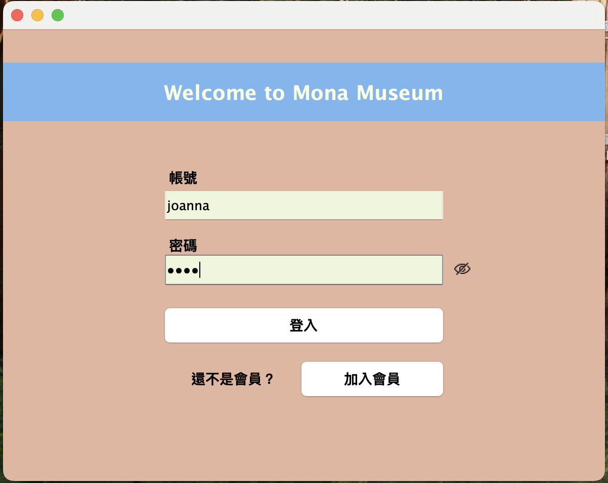

# 🖼️ Mona Museum｜Java Swing 票務與訂單管理系統
一款用 Java Swing 打造的桌面應用程式，專為美術館票務與訂單管理設計，結合視覺化報表、會員系統、訂單流程與匯出功能。 
📄 [查看簡報 PDF（完整介紹）](./MONA MUSEUM｜Java Swing 票務與訂單管理系統.pdf)
待插圖

### 🔍 專案簡介
• 提供會員註冊、登入與會員中心管理功能 
• 支援票券購買、訂單紀錄、訂單查詢與管理 
• 管理員功能包括訂單查詢、編輯、刪除與報表分析 
• 圖表報表整合（JFreeChart）＋ Excel 匯出（Apache POI） 
• 採用 Java Swing 製作完整 GUI 介面

### 💡專案亮點：  
• MVC 架構＋DAO / Service 模組分層 
• 票券選擇與價格計算即時互動 
• 報表以圖表呈現，滑鼠懸停顯示詳細資訊 
• 即時更新資料表與 SQL 資料庫（CRUD） 
• 訂單細項合併呈現，同票種同票期合併統計 

### 📸 使用畫面預覽(完整使用畫面請見 PDF)

#### • Login 畫面展示

#### • AddMember 註冊會員

#### • AddPorder 新增訂單

#### • Finish 訂單完成

#### • FindMyPorder 我的訂單

#### • FindAllPorder 所有訂單

#### • ReportCharts 銷售報表

#### 🧱 技術架構
• Java 17 
• Swing（桌面 GUI） 
• JDBC（MySQL 8） 
• Apache POI（.xlsx 匯出） 
• JFreeChart（報表視覺化） 
• JDatePicker（日期選擇器） 
• Maven 管理依賴

#### 📦 專案結構（模組）
📁 controller         // 使用者介面邏輯（Swing） 
📁 service            // 業務邏輯定義 
📁 service.impl       // 業務邏輯實作 
📁 dao                // DAO 介面定義 
📁 dao.impl           // DAO JDBC 實作 
📁 model              // 資料模型（對應 MySQL） 
📁 util               // 共用工具模組（匯出、格式、連線、列印等） 

#### 🚀 執行方式
1. 匯入專案至 IDE（建議使用 IntelliJ 或 Eclipse） 
2. 建立 MySQL 資料庫並匯入 schema.sql 
3. 調整 DbConnection.java 內連線資訊 
4. 執行 Login.java 或 AdminCenter.java 作為主程式啟動點 
5. 開始模擬會員與管理員操作流程！ 

#### 📘 使用教學
##### 使用者
• 註冊帳號 → 登入 → 選擇票種/票期 → 確認下單 
• 可查詢歷史訂單，匯出與列印明細 
##### 管理員
• 管理全部訂單（修改、刪除即時更新） 
• 查看圖表報表與下載 Excel 
• 權限控管與導引整合於 AdminCenter 

#### 📊 系統模組關係圖

